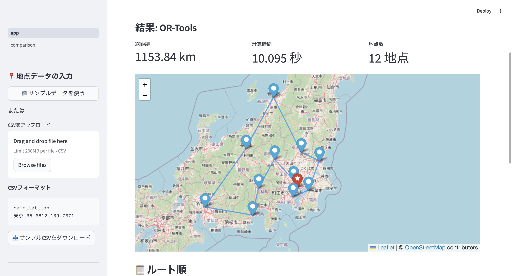

# ルート最適化ツール（Route Optimizer）

CSVで地点を入力するだけで、最短巡回ルートを自動計算するツールです。

👉 **地点データを入力するだけで、最短巡回ルートを自動計算・地図表示できます。**


---

## 解決できる課題

- 複数の訪問先を最短距離で巡回したい
- 手動でルートを決めていて非効率を感じている
- 複数のアルゴリズムの性能差を実際に見比べたい

## 想定ユースケース

- 営業・配送の巡回ルート最適化
- 複数店舗の訪問順序決定
- 物流・宅配ルートの効率化

---

## デモ
### アプリ画面


### デモURL
→ **coming soon** （Streamlit Cloud にデプロイ後URLを記載）

---

## 主な機能

- **CSVによる柔軟な入力**: 地点名・緯度・経度のCSVを読み込むだけで動作
- **サンプルデータ対応**: ワンクリックでサンプルデータを読み込んでデモ可能
- **3アルゴリズムの比較**: OR-Tools・貪欲法+2-opt・SAを並べて比較
- **Folium地図で可視化**: 最適ルートを地図上に描画
- **SAの収束グラフ**: 焼きなまし法のイテレーションごとの距離推移を表示
- **結果のCSVダウンロード**: ルート順・区間距離をCSVで出力

---

## 実装アルゴリズム（TSP）

### OR-Tools（厳密解法）

Google OR-Tools の Routing Library を使い、CP-SATソルバーで最適解を求める。
地点数が多い場合はタイムリミット内の最良解を返す。

### 貪欲法 + 2-opt（局所探索）

**Step 1: 最近傍法（Nearest Neighbor）で初期解を構築**

未訪問の地点のうち、現在地から最も近い地点を順番に選ぶ。

**Step 2: 2-opt で局所最適化**

ランダムに2本のエッジを選び、交差を解消する操作を改善がなくなるまで繰り返す。

```
改善前: ... → A → B → ... → C → D → ...
改善後: ... → A → C → ... → B → D → ...
```

### SA（焼きなまし法）

貪欲法で初期解を構築した後、確率的に悪化を許容しながら局所最適解を脱出する。
近傍操作は 2-opt swap（ランダムな2点間のルートを逆順にする）。

$$P(\text{accept}) = \exp\left(-\frac{\Delta d}{T}\right)$$

温度 $T$ を徐々に下げることで、序盤は広域探索、終盤は局所最適化に集中する。

---

## アルゴリズムの使い分け

| 観点 | OR-Tools | 貪欲法+2-opt | SA |
|---|---|---|---|
| 解の保証 | 最適解を保証 | 保証なし | 保証なし |
| 小規模（〜20点） | 高速・最適 | 高速・良好 | やや遅い |
| 大規模（50点〜） | 時間増大 | 現実的な速度 | 現実的な速度 |
| 解の質 | ★★★ | ★★ | ★★★ |

---

## CSVフォーマット

```csv
name,lat,lon
東京,35.6812,139.7671
横浜,35.4437,139.6380
名古屋,35.1815,136.9066
```

| カラム | 説明 | 例 |
|---|---|---|
| name | 地点名（任意の文字列） | 東京 |
| lat | 緯度（10進数） | 35.6812 |
| lon | 経度（10進数） | 139.7671 |

---

## ファイル構成

```
route-optimizer/
├── app.py                    # メインページ（TSPツール）
├── pages/
│   └── comparison.py         # アルゴリズム比較ページ
├── solver/
│   ├── tsp_ortools.py        # OR-Tools厳密解法
│   ├── tsp_greedy2opt.py     # 貪欲法 + 2-opt
│   └── tsp_sa.py             # 焼きなまし法
├── utils/
│   ├── distance.py           # Haversine距離計算・距離行列生成
│   └── map_viz.py            # Folium地図描画
├── sample_data/
│   └── locations.csv         # サンプル地点データ（主要12都市）
├── requirements.txt
└── packages.txt              # Streamlit Cloud用システムパッケージ（日本語フォント）
```

---

## ローカルで実行

```bash
pip install -r requirements.txt
streamlit run app.py
```

> **注意**: 必ずプロジェクトルート（`route-optimizer/`）から起動してください。

---

## 技術スタック

| 分類 | 技術 |
|---|---|
| 最適化（厳密解） | OR-Tools (Google) |
| 最適化（近似解） | スクラッチ実装（貪欲法・2-opt・SA） |
| 距離計算 | Haversine公式（緯度経度 → 球面距離）|
| フレームワーク | Streamlit |
| 地図描画 | Folium + streamlit-folium |
| データ処理 | pandas |
| 数値計算 | NumPy |

---

## 技術的なポイント

### OR-Toolsによる厳密解と近似解の比較
OR-Tools の Routing Library を使って最適解を保証しつつ、問題規模が大きくなると計算時間が現実的でなくなることを比較ページで可視化しています。厳密解が限界を迎える規模で近似解（貪欲法+2-opt・SA）が有効になるという流れを、距離・計算時間・乖離率で定量的に示しています。

### Haversine公式による球面距離計算
緯度・経度の座標から地点間の距離を求める際、平面近似ではなく Haversine 公式を用いた球面距離計算を実装しています。日本国内程度の距離であれば誤差は小さいですが、正確な距離を使うことで最適化結果の信頼性を高めています。

### SAの収束グラフによるアルゴリズムの可視化
焼きなまし法のイテレーションごとの距離推移を収束グラフとして表示し、温度パラメータが探索の広域性・局所性に与える影響を視覚的に確認できるようにしています。比較ページでパラメータをスライダーで調整しながら挙動を確認できます。

---

## 今後の拡張予定

- [ ] **VRP（Vehicle Routing Problem）**: 複数車両・容量制約あり（例：複数のトラックで荷物を配送、営業チームが手分けして顧客を訪問）
- [ ] **VRPTW**: 配送時間窓制約あり（例：「午前中に届けてほしい」などの時間帯指定がある宅配・食材配送）
- [ ] **距離の種別選択**: 直線距離 / 実際の道路距離（Maps API）

---

## 備考

最適化アルゴリズムの実装・比較を目的として開発したプロジェクトです。OR-Tools・貪欲法・焼きなまし法を同一問題に適用して性能差を定量的に示しており、物流・配送ルート最適化の実務への応用も想定しています。

---

## ライセンス

[MIT License](LICENSE)