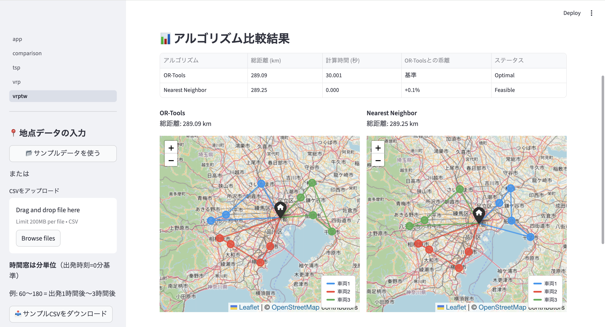

# ルート最適化ツール（Route Optimizer）

TSP・VRP・VRPTWの3種類のルート最適化問題をインタラクティブに解けるツールです。

👉 **地点データをCSVで入力するだけで、最短ルートを自動計算・地図表示できます。**


[](https://route-optimizer-cmpkhqxa9lgsdnnb666agl.streamlit.app/)


---

## 解決できる課題

- 複数の訪問先を最短距離で巡回したい
- 複数台のトラックで効率よく配送したい
- 「午前中に届けてほしい」などの時間指定がある配送を最適化したい
- 複数のアルゴリズムの性能差を実際に見比べたい

## 想定ユースケース

- 営業・配送の巡回ルート最適化（TSP）
- 複数台のトラックによる配送計画（VRP）
- 時間指定配送・宅配ルートの最適化（VRPTW）

---

## デモ
### アプリ画面


### デモURL
Streamlit Cloud でインタラクティブデモを公開しています。\
→ **https://route-optimizer-cmpkhqxa9lgsdnnb666agl.streamlit.app/**

---

## 対応する問題

| 問題 | 概要 | 対応アルゴリズム |
|---|---|---|
| **TSP** | 1台の車両が全地点を1回ずつ巡回する最短ルート | OR-Tools・貪欲法+2-opt・SA |
| **VRP** | 複数車両・容量制約あり | OR-Tools・Clarke-Wright節約法 |
| **VRPTW** | VRP＋各顧客への訪問時間帯の指定 | OR-Tools・Nearest Neighbor（時間窓考慮版） |

---

## 主な機能

- **CSVによる柔軟な入力**: 地点名・緯度・経度・需要量・時間窓をCSVで管理
- **サンプルデータ対応**: ワンクリックでサンプルデータを読み込んでデモ可能
- **アルゴリズム比較**: 厳密解法とヒューリスティクスを並べて比較
- **Folium地図で可視化**: VRP・VRPTWは車両ごとに別色でルートを描画
- **到着時刻の表示**: VRPTWは各顧客への到着時刻と時間窓の充足状況を表示
- **結果のCSVダウンロード**: ルート順・区間距離・到着時刻をCSVで出力

---

## 実装アルゴリズム

### TSP（巡回セールスマン問題）

#### OR-Tools
Google OR-Tools の Routing Library を使い、局所探索ベースで高品質な近似解を求める。

#### 貪欲法 + 2-opt（局所探索）
最近傍法で初期解を構築し、2-opt で局所最適化する。

#### SA（焼きなまし法）
確率的に悪化解を受理することで局所最適解を脱出する。近傍操作は 2-opt swap。

$$P(\text{accept}) = \exp\left(-\frac{\Delta d}{T}\right)$$

### VRP（車両ルーティング問題）

#### OR-Tools
TSP の OR-Tools を容量制約付きに拡張。`AddDimensionWithVehicleCapacity` で各車両の積載量制約を追加する。

#### Clarke-Wright節約法（構築型ヒューリスティクス）
各顧客を独立した1台の車両で訪問する初期解から、節約量の大きいペアを順番に統合していく。

$$S(i,j) = d(\text{depot}, i) + d(\text{depot}, j) - d(i, j)$$

### VRPTW（時間窓付き車両ルーティング問題）

#### OR-Tools
VRP の OR-Tools に時間次元（`AddDimension`）を追加し、各地点の時間窓をハード制約として設定する。

#### Nearest Neighbor 時間窓考慮版（構築型ヒューリスティクス）
最近傍法を時間窓制約に対応させた手法。容量・時間窓・デポへの帰着時刻の3条件を全て満たす最近傍顧客を選択していく。時間窓制約により貪欲な選択が制限されるため、TSP・VRPのヒューリスティクスと比べてOR-Toolsとの解の差が大きくなる傾向がある（SA・LNSなどによる改善は今後の拡張予定）。

---

## アルゴリズムの使い分け

| 観点 | OR-Tools | ヒューリスティクス |
|---|---|---|
| 解の保証 | 保証なし（高品質な近似解） | 保証なし（良好な近似解） |
| 小規模（〜20点） | 高速・高品質 | OR-Toolsより速いが解の質は劣る |
| 大規模（50点〜） | 時間増大 | 現実的な時間で解が得られる |
| 実装の透明性 | ブラックボックス | 手法の仕組みが明確 |

---

## CSVフォーマット

### TSP用（locations.csv）
```csv
name,lat,lon
東京,35.6812,139.7671
横浜,35.4437,139.6380
```

### VRP用（vrp_locations.csv）
```csv
type,name,lat,lon,demand
depot,東京営業所,35.6812,139.7671,0
customer,横浜,35.4437,139.6380,15
```

### VRPTW用（vrptw_locations.csv）
```csv
type,name,lat,lon,demand,time_window_start,time_window_end,service_time
depot,東京営業所,35.6812,139.7671,0,0,480,0
customer,横浜,35.4437,139.6380,15,60,180,15
```

時間窓は**分単位**（デポ出発時刻=0分基準）。例: 60〜180 = 出発1時間後〜3時間後。

---

## ファイル構成

```
route-optimizer/
├── app.py                      # トップページ（ツール選択）
├── pages/
│   ├── tsp.py                  # TSPツール
│   ├── vrp.py                  # VRPツール
│   ├── vrptw.py                # VRPTWツール
│   └── comparison.py           # アルゴリズム比較ページ（TSP/VRP/VRPTW）
├── solver/
│   ├── tsp_ortools.py          # TSP OR-Tools
│   ├── tsp_greedy2opt.py       # 貪欲法 + 2-opt
│   ├── tsp_sa.py               # 焼きなまし法
│   ├── vrp_ortools.py          # VRP OR-Tools
│   ├── vrp_clarke_wright.py    # Clarke-Wright節約法
│   ├── vrptw_ortools.py        # VRPTW OR-Tools
│   └── vrptw_nn.py             # Nearest Neighbor（時間窓考慮版）
├── utils/
│   ├── distance.py             # Haversine距離計算・距離行列生成
│   └── map_viz.py              # Folium地図描画（TSP・VRP・VRPTW対応）
├── sample_data/
│   ├── locations.csv           # TSPサンプル（主要12都市）
│   ├── vrp_locations.csv       # VRPサンプル（デポ+顧客12地点）
│   └── vrptw_locations.csv     # VRPTWサンプル（時間窓付き）
├── requirements.txt
└── packages.txt                # Streamlit Cloud用（日本語フォント）
```

---

## ローカルで実行

```bash
pip install -r requirements.txt
streamlit run app.py
```

> **注意**: 必ずプロジェクトルート（`route-optimizer/`）から起動してください。

---

## 技術スタック

| 分類 | 技術 |
|---|---|
| 最適化 | OR-Tools (Google) |
| 最適化（スクラッチ実装） | 貪欲法・2-opt・SA・Clarke-Wright・Nearest Neighbor |
| 距離計算 | Haversine公式（緯度経度 → 球面距離・将来的に道路距離へ差し替え可能） |
| フレームワーク | Streamlit |
| 地図描画 | Folium + streamlit-folium |
| データ処理 | pandas |
| 数値計算 | NumPy |

---

## 技術的なポイント

### 問題の段階的な拡張
TSP → VRP（容量制約を追加）→ VRPTW（時間窓制約を追加）という順に問題を拡張しており、OR-Toolsのコードでは制約の追加方法を段階的に確認できます。

### Haversine公式による球面距離計算
緯度・経度の座標から地点間の距離を求める際、平面近似ではなくHaversine公式を用いた球面距離計算を実装しています。将来的にGoogle Maps APIの道路距離に差し替え可能な設計にしています。

### 車両ごとの色分け可視化
VRP・VRPTWでは車両ごとに異なる色でルートを描画し、どの車両がどの顧客を担当しているかを一目で確認できます。

### VRPTW の大規模問題への対応
OR-Toolsのタイムリミット設定により大規模問題にも対応しています。また、OR-Toolsとは独立したヒューリスティクスとしてNearest Neighborを実装しており、アルゴリズムの性能比較が可能です。ただしNNは局所探索による改善を行わない構築型ヒューリスティクスのため、OR-Toolsとの解の差はTSP・VRPより大きくなります。SA・LNSなどによる改善は今後の拡張予定です。

---

## 今後の拡張予定

- [ ] **距離の種別選択**: 直線距離 / 実際の道路距離（Maps API）
- [ ] **LNS（Large Neighborhood Search）**: VRPTWの大規模問題向け高速化
- [ ] **マルチデポVRP**: 複数の出発拠点に対応

---

## 備考

最適化アルゴリズムの実装・比較を目的として開発したプロジェクトです。TSP・VRP・VRPTWを同一フレームワーク内で実装し、厳密解法と近似解法の性能差を定量的に示しており、物流・配送ルート最適化の実務への応用も想定しています。

---

## ライセンス

[MIT License](LICENSE)